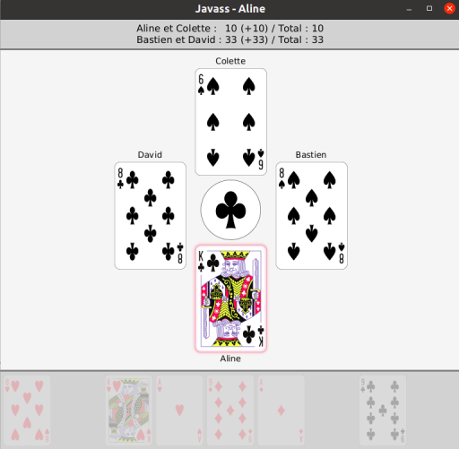

# Javass

A desktop app for playing [Jass](https://en.wikipedia.org/wiki/Jass) with online or simulated players. Made during CS-108 at EPFL.

## Features

* Simulation of a game of Jass
* Simulated AI players using the Monte Carlo tree search algorithm
* Online multiplayer using TCP sockets
* Graphical interface made with JavaFX

## Authors

* Thomas Berkane
* Yingxuan Duan
